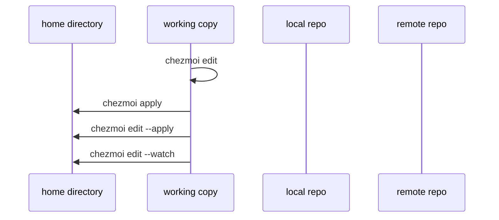
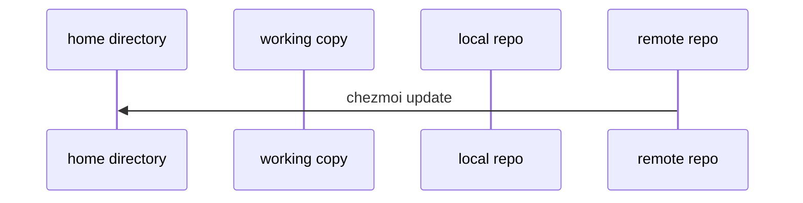
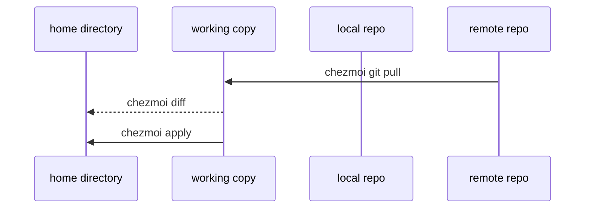
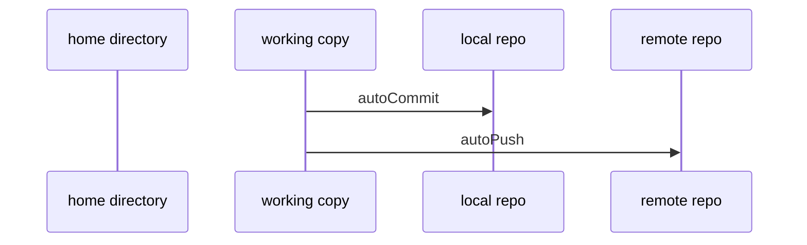

# Dotfiles

[](https://github.com/cearley/dotfiles/actions)
[](https://www.apple.com/macos/)
[](https://www.chezmoi.io/)
[](https://brew.sh/)
[](https://github.com/cearley/dotfiles/commits)

My personal dotfiles and macOS development environment setup, managed with [chezmoi](https://chezmoi.io).

## Table of Contents

- [Why You Might Find This Useful](#why-you-might-find-this-useful)
- [Quick Start](#quick-start)
- [Daily operations](#daily-operations)
- [Before Forking or Using](#before-forking-or-using)

## Why You Might Find This Useful

This repository uses several chezmoi patterns that you might find helpful:
- **Secure secret management** using KeePassXC integration (no hardcoded credentials)
- **Multi-machine support** with conditional configurations for different Macs
- **Automated dependency installation** with proper error handling and logging
- **Tag-based execution** to customize setups for different use cases (work, personal, AI/ML)
- **Comprehensive validation** with pre/post-installation hooks
- **System-wide configuration management** - Shows how to manage `/etc/hosts` and other system files outside the home directory using chezmoi scripts

## Quick Start

Bootstrap a new macOS machine with a single command:

```sh
sh -c "$(curl -fsSL https://raw.githubusercontent.com/cearley/dotfiles/main/remote_install.sh)"
```

You can also pass arguments to chezmoi by appending them:

```sh
sh -c "$(curl -fsSL https://raw.githubusercontent.com/cearley/dotfiles/main/remote_install.sh)" -- init --apply $GITHUB_USERNAME --keep-going --verbose
```

This automatically installs all dependencies (Git, Homebrew, chezmoi, KeePassXC, etc.) and applies your dotfiles.

**Requirement:** A KeePassXC database file is needed for password management.

## Daily operations

### Edit your dotfiles

Edit a dotfile with:

```sh
chezmoi edit $FILENAME
```

This will edit `$FILENAME`'s source file in your source directory. chezmoi will
not make any changes to the actual dotfile until you run `chezmoi apply`.

To automatically run `chezmoi apply` when you quit your editor, run:

```sh
chezmoi edit --apply $FILENAME
```

To automatically run `chezmoi apply` whenever you save the file in your editor, run:

```sh
chezmoi edit --watch $FILENAME
```

You don't have to use `chezmoi edit` to edit your dotfiles. For more
information, see [Do I have to use `chezmoi edit` to edit my
dotfiles?](frequently-asked-questions/usage.md#how-do-i-edit-my-dotfiles-with-chezmoi)



### Pull the latest changes from your repo and apply them

You can pull the changes from your repo and apply them in a single command:

```sh
chezmoi update
```

This runs `git pull --autostash --rebase` in your source directory and then
`chezmoi apply`.



### Pull the latest changes from your repo and see what would change, without actually applying the changes

Run:

```sh
chezmoi git pull -- --autostash --rebase && chezmoi diff
```

This runs `git pull --autostash --rebase` in your source directory and `chezmoi
diff` then shows the difference between the target state computed from your
source directory and the actual state.

If you're happy with the changes, then you can run

```sh
chezmoi apply
```

to apply them.



### Automatically commit and push changes to your repo

chezmoi can automatically commit and push changes to your source directory to
your repo. This feature is disabled by default. To enable it, add the following
to your config file:

```toml title="~/.config/chezmoi/chezmoi.toml"
[git]
    autoCommit = true
    autoPush = true
```

Whenever a change is made to your source directory, chezmoi will commit the
changes with an automatically-generated commit message (if `autoCommit` is true)
and push them to your repo (if `autoPush` is true). `autoPush` implies
`autoCommit`, i.e. if `autoPush` is true then chezmoi will auto-commit your
changes. If you only set `autoCommit` to true then changes will be committed but
not pushed.

By default, `autoCommit` will generate a commit message based on the files
changed. You can override this by setting the `git.commitMessageTemplate`
configuration variable. For example, to have chezmoi prompt you for a commit
message each time, use:

```toml title="~/.config/chezmoi/chezmoi.toml"
[git]
    autoCommit = true
    commitMessageTemplate = "{{ promptString \"Commit message\" }}"
```

If your commit message is longer than fits in a string then you can set
`git.commitMessageTemplateFile` to specify a path to the commit message template
relative to the source directory, for example:

```toml title="~/.config/chezmoi/chezmoi.toml"
[git]
    autoCommit = true
    commitMessageTemplateFile = ".commit_message.tmpl"
```

Be careful when using `autoPush`. If your dotfiles repo is public and you
accidentally add a secret in plain text, that secret will be pushed to your
public repo.



## Before Forking or Using

### What You Need to Consider

This is my personal dotfiles repository, reflecting my specific preferences, workflows, and development needs. What works for me may not align with your setup:

- **Development focus** - Configured for cloud development (AWS, Azure), AI/ML work, and macOS-specific tools
- **Security preferences** - Uses KeePassXC for all credential management, which requires initial setup
- **Workflow assumptions** - Assumes use of specific tools like ChronoSync for backups, Syncthing for file sync
- **Package choices** - Includes my preferred development stack which may be overkill or missing tools you need
- **System modifications** - Makes opinionated changes to macOS defaults and system configurations

Consider this repository as a learning resource and starting point rather than something to use directly.

### What You'll Need to Customize

If you decide to fork or use this repository, you'll need to customize several key areas:

- **KeePassXC database** - Set up your own password manager with the entries this config expects
- **Package lists** - Review `home/.chezmoidata/packages.yaml` and customize for your needs
- **Personal services** - Remove ChronoSync, Syncthing, or other personal workflow tools
- **SSH/Git configuration** - Update for your own accounts and preferences
- **Network configurations** - Remove personal hosts file management

### Initial Setup Variables
When you first run chezmoi, you'll be prompted for:
- **Full name** - Used in Git configuration and system setup
- **GitHub username** - For Git configuration and script environment
- **GitHub emails** - Separate emails for default and work repositories
- **KeePassXC database path** - Location of your password database file
- **Microsoft email** (optional) - Enables Microsoft Defender installation
- **Machine tags** - Choose from: ai, ml, mobile, personal, school, work

Tags control which scripts run and which tools get installed. For example, "work" enables NVM and SSH validation, while "ai" installs additional ML tools.
