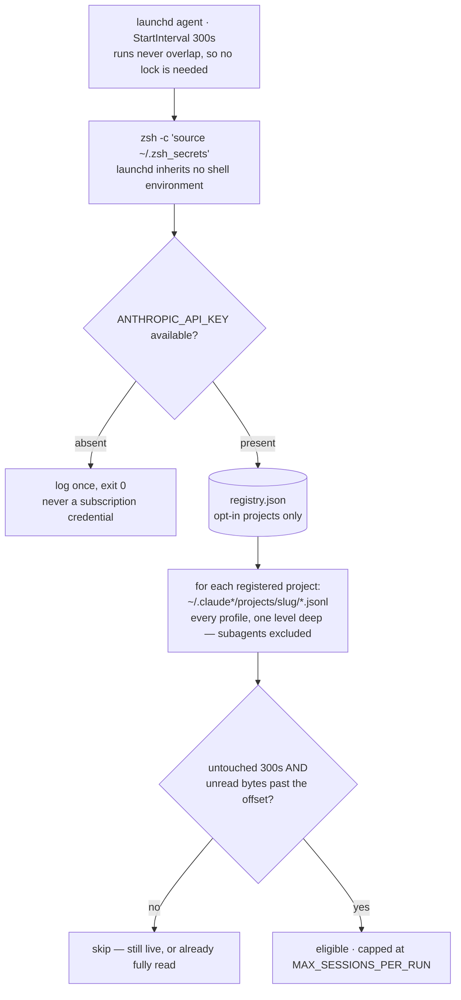
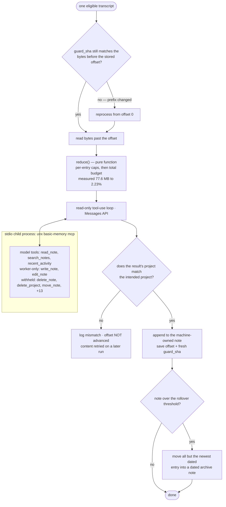
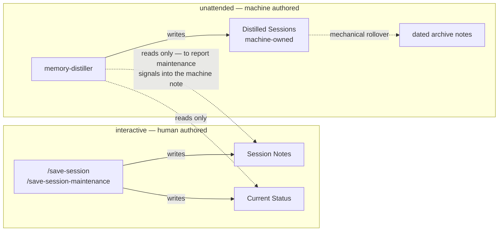

## Context

See `proposal.md` — Why for motivation, and
`openspec/changes/archive/2026-08-27-autonomous-save-session/` for the abandoned approach's full
record (17 implementation findings, the fork-bomb post-mortem, and the code review that ended it).
Read that before proposing anything that spawns a Claude Code session from a Claude Code hook.

Constraints that shape this design:

- **`flock(1)` does not exist on stock macOS.** This is what forced the abandoned change into a
  hand-rolled `mkdir` lock with stale-reclaim and holder files. Any design that needs a lock in
  bash pays that cost; Python's `fcntl.flock` and launchd's own serialisation do not.
- **basic-memory owns its index.** Writing vault files directly means hand-maintaining frontmatter
  and permalinks and letting the index drift from disk — a failure this project already hit (the
  project-mixup / ghost-index incident).
- **`edit_note` silently defaults to whatever project the MCP server considers current** when
  `project` is omitted. That is a misfile, not an error.
- **Four Claude Code personas** (`~/.claude`, `-bedrock`, `-personal`, `-work`) each keep their own
  `projects/` transcript directory.
- **Secrets rendered by chezmoi land on disk at apply time**; KeePassXC requires an interactive
  unlock and so cannot be read by a headless agent.

## Goals / Non-Goals

**Goals:**

- No lock files, no session-identity plumbing, no hook-driven process spawning.
- Crash recovery handled by the same code path as the normal case, not a special one.
- A blast radius small enough that unsupervised model output cannot damage curated content.
- One copy of the worker to maintain, not one per project.

**Non-Goals:**

- Streaming or incremental capture of live sessions.
- Making the worker resilient to basic-memory being absent — it degrades to a logged no-op.
- Preserving `sync-memory`'s dual-mode (in-session + standalone) design. The new worker is
  standalone-only; the in-session path is what `/save-session` already is.

## Decisions

**1. Poll on a launchd interval rather than trigger from a hook.** One machine-level agent,
`StartInterval` 300s. *Alternative considered:* a `SessionEnd` hook that touches a sentinel file
the worker consumes. Rejected — it reintroduces a hook with its own failure mode, and still needs
quiescence as a fallback for crashed sessions where `SessionEnd` never fires, so you implement two
mechanisms to buy latency the requirements don't ask for. *Alternative:* `WatchPaths` on the
transcript directory. Rejected as firing on every token written during a live session.

**2. Detect completion by quiescence: untouched ≥300s with unread bytes.** This single test
subsumes session-end detection, crash recovery, and the live-session hazard (a running session is
by definition not quiet; a killed session goes quiet exactly like a clean one). *Alternative:*
compare a marker to the newest transcript, as the abandoned change did. Rejected — that is
precisely the gate whose termination condition proved so subtle that two distinct runaway-spawn
bugs hid in it.

**3. One agent plus a registry, not one agent per project.** A single process working through
registered projects sequentially means two workers can never run concurrently, so no lock is
needed at all. *Alternative:* per-project agents, relying on launchd's per-label serialisation.
Rejected — N idle timers and N plists outside chezmoi's control.

**4. All vault access goes through the basic-memory MCP server.** The worker spawns
`uvx --python 3.12 basic-memory mcp` over stdio, lists its tools, converts them to Anthropic tool
definitions, and runs a tool-use loop; the model calls `search_notes`/`write_note`/`edit_note`
itself. *Alternative:* direct vault file writes, as `sync-memory --standalone` does today.
Rejected on the index-drift constraint above. *Alternative:* the Claude Agent SDK. Rejected — it
reintroduces the Claude Code harness this change exists to get out of.

**4a. Only an allowlisted subset of the server's tools is exposed to the model.** Added 2026-08-28
during task 5.1. The real basic-memory MCP server (4.0.0b1) exposes **21** tools, among them
`delete_note`, `delete_project` and `move_note`. Converting the server's whole tool list into
Anthropic tool definitions — as Decision 4 as originally written implies — would hand an
unsupervised model the ability to delete curated notes or an entire project, leaving the design's
central invariant enforced only by an after-the-fact assertion (task 7.4) that the model happened
not to do so.

The model is exposed only `read_note`, `search_notes`, and `recent_activity`. The worker itself
uses `write_note` and `edit_note` only with preselected machine-owned targets: `Distilled Sessions`
and its dated archives. Anything else the server offers is unavailable to the model. This makes
"cannot damage curated content" structural rather than behavioural, while retaining MCP ownership
of frontmatter, permalinks, and indexing. New tools appearing in a future basic-memory release are
excluded by default rather than silently acquired.

**5. Model instructions come from two sources.** A repo-authored distillation skill at
`home/dot_local/share/memory-distiller/distill.md` carries this project's conventions (pass
`project=` explicitly, `[category]` observation prefixes, `[[wikilinks]]`, never write curated
notes); basic-memory's own `memory://ai_assistant_guide` resource is fetched from the server at
runtime so it tracks the installed version rather than a hand-mirrored copy.

**6. The worker may append and observe; it may not rewrite curated content.** It writes exactly one
machine-owned note per project. Threshold crossings are reported into a `## Maintenance signals`
section of that same note, visible through normal start-of-session recall — no new hook, no write
to curated content. Acting on them stays interactive.

The live `Distilled Sessions` note rolls over at **60,000 characters**. Its archive title is
`Distilled Sessions Archive — YYYY-MM-DD`, dated by the rollover run. The worker reports, but does
not act on, these curated-note conditions: `Chezmoi Current Status` over **20,000 characters** or
missing `## Status Summary` / `## Open`; and `Chezmoi Session Notes` over **60,000 characters**.
The report is replaced on each run, so resolved findings disappear rather than accumulating.

**7. A single machine-level script, not a per-project rendered copy.** chezmoi's own apply replaces
`check-drift.sh`'s version-marker and drift machinery for this component entirely.

**8. Byte offsets advance only after a verified successful write, and are themselves guarded by a
hash.** Verification means reading back the tool result's own `project:` and `permalink:` fields and
confirming the project matches. An interrupted or failed run re-processes rather than silently
dropping content.

Per-session state stores the offset *and* `guard_sha`, the SHA-256 of the `GUARD_BYTES` (4096)
immediately preceding the offset — or of `[0, offset)` when the file is shorter than that. Before
trusting a stored offset the worker re-hashes that range and compares. On mismatch it logs and
reprocesses the transcript from 0 rather than resuming mid-file.

This exists because the append-only assumption was verified only as far as passive observation
reaches (task 1.2): 279 transcripts showed zero rewritten prefixes and zero truncations, and a live
append was confirmed to leave its prefix intact, but no transcript was observed *across a resume
boundary*. The guard converts an assumption that would fail silently — skipped content, no signal —
into one that is re-checked every run and self-heals if Claude Code's behaviour ever changes. It
costs one 4 KB read and one hash per session per run.

**9. Verification strategy.** Pure functions (transcript reduction, eligibility, rollover, offset
advance) are unit-tested over fixtures with no network, clock or vault. The tool-use loop is tested
against a fake stdio MCP server replaying canned results. One end-to-end test runs the worker
against a temp `HOME`, temp vault and synthetic transcripts — never against real system state.

**10. Transcript reduction keeps conversation and discards machinery — measured, not guessed.**
Settled 2026-08-27 against all 80 real transcripts in this project (77 MB total). Two measurements
overturned the working assumption:

- *A `user` record is not necessarily something the user said.* `user` records whose `content` is a
  **list** carry injected skill and system text, not human input — one held 34 KB of skill-creator
  documentation. Genuine turns are the records whose `content` is a plain **string**. A naive
  "keep user text" rule imports skill boilerplate as if the user had written it.
- *A single entry can swamp a session.* The largest reduced output was 201.5 KB, 90.8% of which was
  one pasted SpecStory transcript; that session's real turns were 56–506 characters. A total budget
  alone is insufficient — entries need individual caps.

| Record / block | Treatment |
|---|---|
| Types other than `user`/`assistant` (9 kinds) and `attachment` | Dropped — ~70% of bytes, pure metadata |
| `user`, string content | Kept verbatim, capped at `MAX_USER_CHARS` |
| `user` string starting `<bash-input>` | `$ <cmd>`, capped at `MAX_BASH_CHARS` |
| `user` string starting `<bash-stdout>` / `<local-command` | Dropped |
| `user` string starting `<task-notification>` / `<command-message>` / `<command-args>` | Dropped |
| `user` string starting `<command-name>` | Kept as `user: /<command>`, capped at `MAX_BASH_CHARS` |
| `user`, list content, `text` block | One-line marker `[injected: <first line>]`; body dropped |
| `user`, list content, `tool_result` | Dropped unless `is_error`, then first `MAX_ERROR_CHARS` |
| `assistant`, `text` | Kept verbatim, capped at `MAX_ASSISTANT_CHARS` |
| `assistant`, `thinking` | Dropped (near-empty in the JSONL regardless) |
| `assistant`, `tool_use` | One line `-> Name(<identifying arg>)`, capped at `MAX_TOOL_CHARS` |

Successful tool output is dropped entirely: it is noise the assistant already summarises in prose,
whereas failures carry the gotcha-and-fix content the distillation exists to capture.

Every limit is a **named module-level constant, not a literal**, so it can be retuned without
touching logic: `MAX_USER_CHARS=2000`, `MAX_ASSISTANT_CHARS=4000`, `MAX_TOOL_CHARS=120`,
`MAX_ERROR_CHARS=300`, `MAX_BASH_CHARS=200`, `TOTAL_CHAR_BUDGET=100_000`. Truncation is always
marked inline (`[…N chars truncated]`) so the model can tell abridgement from absence. The total
budget truncates oldest-first with a leading marker.

Measured outcome: 77 MB → 1.71 MB (2.22%); median session 10.4 K chars (~2,600 input tokens); worst
case 89.6 K; **0 of 80 sessions hit the total budget**, because the per-entry caps absorb the
outliers. The 50 K budget inherited from `sync-memory` would have truncated 21%.

**Table extended 2026-08-28 during implementation (task 3.3), again by measurement.** The three
tag prefixes above were not the whole set. Of 859 `user`-string records in this project's corpus,
only 503 are genuine human turns; the other 356 are machinery wearing a human turn's clothes:
`<local-command-caveat>` (96), `<command-name>` (96), `<command-message>` (84),
`<local-command-stdout>` (53), `<task-notification>` (19), `<bash-input>`/`<bash-stdout>` (4).
Without the added rows, task-notification bodies and slash-command boilerplate would have been
attributed to the user verbatim. `<command-name>` is *kept* as a compact marker rather than
dropped, because which command drove a session is decision-worthy even though its body is not.

Re-verified against the implementation (task 3.4): 104 transcripts, 77.6 MB → 1.73 MB = **2.23%**,
worst case 96.4 K, **0 sessions hit the budget**. The ratio reproduces the 2.22% baseline to within
0.01pp. Median fell from 10.4 K to 2.9 K, which is the added drop rules plus 24 mostly-short
sessions joining the corpus since 2026-08-27 — total volume is unchanged, so no rule is discarding
substance.

### Architecture

**When the worker runs, and what it will look at:**

**What then happens to one eligible transcript:**

Every failure path leads to *not* advancing the offset, so the worst case is repeated work rather
than lost content. The only edge that advances state runs through a verified project match.

| Component | Location | Managed by |
|---|---|---|
| Worker | `home/dot_local/bin/executable_memory-distiller` | chezmoi (untemplated) |
| launchd agent | `home/private_Library/LaunchAgents/io.github.cearley.memory-distiller.plist.tmpl` | chezmoi (templated) |
| Agent loader | existing `run_onchange_after_darwin-40-*` pattern | chezmoi |
| Distillation skill | `home/dot_local/share/memory-distiller/distill.md` | chezmoi (untemplated) |
| Registry | `~/.local/state/memory-distiller/registry.json` | runtime (**not** chezmoi) |
| Per-project state | `~/.local/state/memory-distiller/<slug>.json` | runtime |
| Log | `~/.local/state/memory-distiller/distiller.log` | runtime |

The registry is deliberately not chezmoi-managed: `chezmoi apply` would clobber runtime
registrations. `<slug>` is the mangled project root (`/`→`-`, `.`→`-`), the same mangling used to
locate transcripts at `~/.claude*/projects/<mangled>/*.jsonl` — globbing the persona prefix picks
up all four without hardcoding them, and survives a new one being added.

That glob is deliberately **one level deep, which excludes subagent transcripts**. Measured
2026-08-28: of 763 `.jsonl` files across the four profiles, 480 are subagent transcripts at
`<session-id>/subagents/*.jsonl` and only 283 are top-level session transcripts. Subagent files are
skipped because the parent session's transcript already contains each subagent's final report, so
distilling them would pay for the same content twice and would attribute a subagent's internal
reasoning to the session. If subagent content is ever wanted, it needs its own decision — it must
not arrive by loosening the glob to a recursive walk.

Dependencies (`anthropic`, `mcp`) are declared as PEP 723 inline script metadata and run via
`uv run`, matching the repo's existing `uvx` usage — no venv to manage.

### The invariant this design rests on

> The worker writes exactly one note, and nothing else ever writes that note.

The two write sets are disjoint, and that — not the choice of MCP — is what makes the worker
lock-free. The dotted edges are reads: thresholds crossed on curated notes are *reported* into the
machine note, never acted on.

Lock-freedom follows from note-level disjointness, **not** from avoiding MCP. Any future change
that widens the worker's write scope must revisit this decision explicitly, because coordination
comes straight back with it.

## Risks / Trade-offs

- [Distillation quality is unsupervised — Haiku reading a reduced transcript with no conversational
  context is worse than an in-session save] → Output lands only in a machine note nothing depends
  on; curated notes remain human-written.
- [API cost scales with usage, not with a fixed schedule] → Per-run token ceiling and cost logging
  from day one; per-run backlog cap inherited from `sync-memory`.
- [The registry is a second source of truth about which projects are enabled, and can drift] → Kept
  trivially small and inspectable; a registry entry pointing at a deleted directory is logged and
  skipped, never auto-removed.
- [launchd may not serialise `StartInterval` runs of the same label — load-bearing for "no locks"]
  → Verified by experiment before relying on it; `fcntl.flock` is a three-line fallback, not a
  redesign.
- [Byte offsets assume Claude Code only ever appends to a transcript] → Verified over 279 real
  transcripts (0 rewrites, 0 truncations) but not across a resume boundary, so the assumption is
  additionally enforced at runtime by the `guard_sha` in Decision 8: a changed prefix triggers
  reprocessing from 0 instead of silently skipping content.
- [`uvx` cold start adds latency and the MCP server is a second process that can fail
  independently] → Failure is logged and the project skipped; the next interval retries.
- [Losing SpecStory removes a human-readable markdown history that JSONL does not replace] →
  Accepted deliberately: existing `.specstory/history/` files remain, and the distilled note is the
  durable artifact going forward.

## Migration Plan

1. Build and verify the worker. Nothing needs to be disabled first — the abandoned machinery is
   already gone from the working tree and was never committed to `main`.
2. Register this project only, confirm distilled output is sane over several real sessions.
3. Remove `sync-memory` in full — skill, script, both `.template` mirrors, and its two
   `check-drift.sh` pieces. (The hook scripts, guard and lock machinery need no removal step: they
   never reached this repository's history, having been abandoned on an unpushed branch.)
4. Remove SpecStory from `packages.yaml` — from the `ai` block **and** the `trusted:` list, which
   are hand-synced with no automatic check.
5. Retire `openspec/specs/sync-memory/` and amend `openspec/specs/setup-memory-workflow/`.
6. Register remaining projects.

**Rollback:** the worker is one script plus one plist; `launchctl unload` stops it and leaves no
residue beyond `~/.local/state/memory-distiller/`. Because it only ever writes its own note,
rollback cannot corrupt curated content. Steps 3–5 are the irreversible half and come last,
deliberately — until then the old machinery is still on disk.

**Salvage from the abandoned change:** with the hooks gone, most of what its five commits fixed
goes with them (`$CLAUDE_PROJECT_DIR` anchoring, the `matcher` argument, the `sync-memory-script`
filename bug). The durable keeper is the split of `save-session` into append-only work plus a
separate `save-session-maintenance` skill, with its cross-skill reference cleanups. That is
cherry-picked onto a clean base; the automation is discarded.

## Open Questions

1. **The 300s interval and 300s quiet window** are estimates of "within a few minutes" and should
   be tuned against real usage.
2. **Confirm the current Haiku model ID and pricing** via the `claude-api` skill before writing any
   API code (`sync-memory` currently pins `claude-haiku-4-5-20251001`).

*(Resolved 2026-08-27: transcript reduction heuristics — see Decision 10.)*
